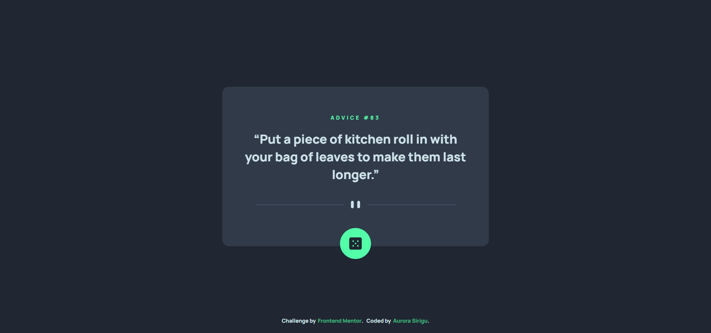
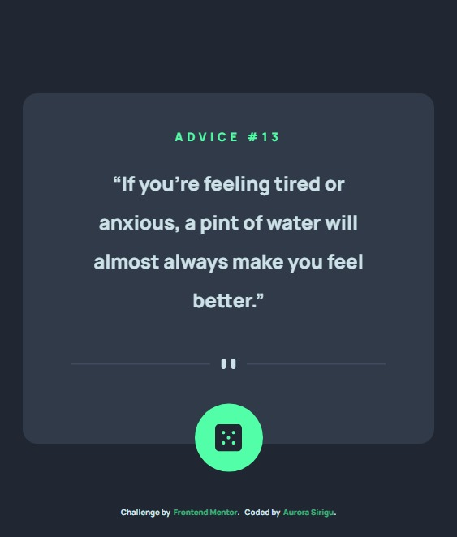
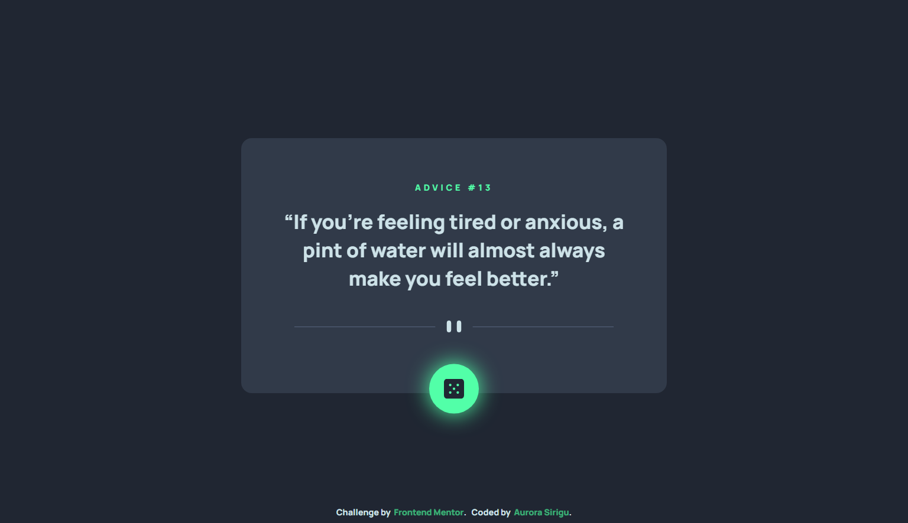

# Frontend Mentor - Advice Generator App solution

This is a solution to the [Todo app challenge on Frontend Mentor](https://www.frontendmentor.io/challenges/advice-generator-app-QdUG-13db). Frontend Mentor challenges help you improve your coding skills by building realistic projects.

## Table of contents

- [Overview](#overview)
  - [The challenge](#the-challenge)
  - [Screenshot](#screenshot)
  - [Links](#links)
- [My process](#my-process)
  - [Built with](#built-with)
  - [What I learned](#what-i-learned)
- [Author](#author)

## Overview

### The challenge

This is a simple React application that allows the user to generate random alerts by clicking on a dedicated button that fetches the data from the Advice Slip JSON API.

Users should be able to:

- View the optimal layout for the app depending on their device's screen size
- See hover states for all interactive elements on the page
- Generate a new piece of advice by clicking the dice icon

### Screenshot

### Links

- Solution URL: [https://www.frontendmentor.io/solutions/todo-app-using-reactjs-and-react-beautiful-dnd-library-JTOuJQmB9]
- Live Site URL: [https://advice-generator-app-frontend-mentor.netlify.app/]

## My process

### Built with

- [React](https://reactjs.org/) - JS library
- [Advice Slip JSON API](https://api.adviceslip.com/)
- SCSS
- Flexbox
- Mobile-first workflow
- axios (https://www.npmjs.com/package/axios)
- react-responsive (https://www.npmjs.com/package/react-responsive)
- react-animated-css (https://www.npmjs.com/package/react-animated-css)

### What I learned

Developing this app, although basic, has helped me to keep my skills in React trained and to refine the UI design of the components.

## Author

- Frontend Mentor - [@Auro-93](https://www.frontendmentor.io/profile/Auro-93)
- [Github-Profile](https://github.com/Auro-93)
- [Linkedin-Profile](https://www.linkedin.com/in/aurora-sirigu-a001301b4/)
- [Portfolio](https://aurodev-web-developer-portfolio.netlify.app/)
